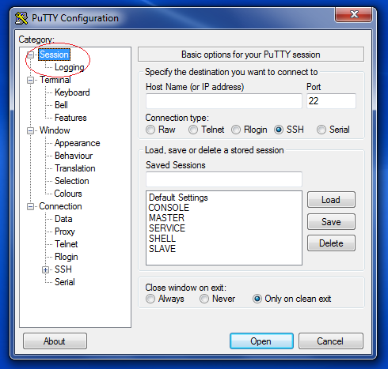
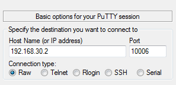

<!-- ------------------------Document header ------------------------------------>
 
 ___

   
   

<!-- ------------------------Document TITLE PAGE --------------------------------->
 

Z175 MAIN CPU

IRS Command Interface

REV : ID10

   
   
   
   

|Date |Revision | Change log| Author|
|:---| :----: | :----: |:---|
|01/01/2023|ID9|First release| M. Rispoli|
|25/01/2023|ID10|Added Configuration commands| M. Rispoli|

- [1. Document Overview](#1-document-overview)
- [2. IRS Overview](#2-irs-overview)
- [3. IRS activation](#3-irs-activation)
- [4. PC connection setup](#4-pc-connection-setup)
- [5. IRS connection establishment](#5-irs-connection-establishment)
- [6. Command syntax](#6-command-syntax)
- [7. Group command description](#7-group-command-description)
  - [7.1. SYSTEM COMMANDS (system:)](#71-system-commands-system)
    - [7.1.1. ***setDATE***](#711-setdate)
    - [7.1.2. ***getRevisions***](#712-getrevisions)
    - [7.1.3. ***setShotMode***](#713-setshotmode)
    - [7.1.4. ***setShotNodetMode***](#714-setshotnodetmode)
    - [7.1.5. ***setCalibKv***](#715-setcalibkv)
    - [7.1.6. ***setCalibIa***](#716-setcalibia)
    - [7.1.7. ***setCalibTomo***](#717-setcalibtomo)
    - [7.1.8. ***setOperatingMode***](#718-setoperatingmode)
    - [7.1.9. ***reboot***](#719-reboot)
    - [7.1.10. ***setPowerOff***](#7110-setpoweroff)
    - [7.1.11. ***setUnpark***](#7111-setunpark)
    - [7.1.12. ***setPark***](#7112-setpark)
  - [7.2. CONFIGURATION COMMANDS (config:)](#72-configuration-commands-config)
    - [7.2.1. ***setAutoFilter***](#721-setautofilter)
    - [7.2.1. ***setHsStarter***](#721-sethsstarter)
    - [7.2.1. ***setArmMotor***](#721-setarmmotor)
    - [7.2.1. ***setTrxMotor***](#721-settrxmotor)
    - [7.2.1. ***enableAccessory***](#721-enableaccessory)
    - [7.2.2. ***setSN***](#722-setsn)
    - [7.2.3. ***setPSW***](#723-setpsw)
    - [7.2.4. ***enableStarterKeep***](#724-enablestarterkeep)
    - [7.2.5. ***setTubeTemp***](#725-settubetemp)
    - [7.2.6. ***setLanguage***](#726-setlanguage)
    - [7.2.7. ***resetGantry***](#727-resetgantry)
    - [7.2.8. ***resetKvCalib***](#728-resetkvcalib)
    - [7.2.9. ***sysBackup***](#729-sysbackup)
    - [7.2.10. ***sysRestore***](#7210-sysrestore)
  - [7.3. COLLIMATOR COMMANDS (collimatore:)](#73-collimator-commands-collimatore)
    - [7.3.1. Collimator configuration](#731-collimator-configuration)
      - [7.3.1.1. ***readColliConf***](#7311-readcolliconf)
      - [7.3.1.2. ***setCalib2D***](#7312-setcalib2d)
      - [7.3.1.3. ***setCalibCustom***](#7313-setcalibcustom)
      - [7.3.1.4. ***getCalib***](#7314-getcalib)
      - [7.3.1.5. ***STORE***](#7315-store)
      - [7.3.1.6. ***download***](#7316-download)
    - [7.3.2. Collimation format activation](#732-collimation-format-activation)
      - [7.3.2.1. ***getStatus***](#7321-getstatus)
      - [7.3.2.2. ***setManual***](#7322-setmanual)
      - [7.3.2.3. ***setAuto***](#7323-setauto)
      - [7.3.2.4. ***setL***](#7324-setl)
      - [7.3.2.5. ***setR***](#7325-setr)
      - [7.3.2.6. ***setF***](#7326-setf)
      - [7.3.2.7. ***setB***](#7327-setb)
      - [7.3.2.8. ***setT***](#7328-sett)
      - [7.3.2.9. ***update***](#7329-update)
    - [7.3.3. Filter activation commands](#733-filter-activation-commands)
      - [7.3.3.1. ***setFiltro***](#7331-setfiltro)
      - [7.3.3.2. ***setCalibFiltro***](#7332-setcalibfiltro)
    - [7.3.4. Mirror and Light activation commands](#734-mirror-and-light-activation-commands)
      - [7.3.4.1. ***setMirror***](#7341-setmirror)
      - [7.3.4.2. ***setLamp***](#7342-setlamp)
      - [7.3.4.3. ***setCalibMirror***](#7343-setcalibmirror)
    - [7.3.5. Test commands](#735-test-commands)
      - [7.3.5.1. ***setTrx***](#7351-settrx)
      - [7.3.5.2. ***testColli***](#7352-testcolli)
  - [7.4. COMPRESSOR COMMANDS (compressore:)](#74-compressor-commands-compressore)
    - [7.4.1. Configuration File Modification](#741-configuration-file-modification)
      - [7.4.1.1. ***readPadConfig***](#7411-readpadconfig)
      - [7.4.1.2. ***storePadConfid***](#7412-storepadconfid)
    - [7.4.2. Trolley Calibration Commands](#742-trolley-calibration-commands)
      - [7.4.2.1. ***setCalibPos***](#7421-setcalibpos)
      - [7.4.2.2. ***getCalibPos***](#7422-getcalibpos)
      - [7.4.2.3. ***getTrolley***](#7423-gettrolley)
    - [7.4.3. Breast Thickness Calibration](#743-breast-thickness-calibration)
      - [7.4.3.1. ***getPadList***](#7431-getpadlist)
      - [7.4.3.2. ***setCalibPad***](#7432-setcalibpad)
      - [7.4.3.3. ***setThick***](#7433-setthick)
      - [7.4.3.4. ***setKF***](#7434-setkf)
    - [7.4.4. Compression Force Parameters](#744-compression-force-parameters)
      - [7.4.4.1. ***setWeight***](#7441-setweight)
      - [7.4.4.2. ***setLimitForce***](#7442-setlimitforce)
  - [7.5. MOTOR ACTIVATION COMMANDS (rotazioni:)](#75-motor-activation-commands-rotazioni)
    - [7.5.1. Configuration File Management](#751-configuration-file-management)
      - [7.5.1.1. ***readTrxConfig***](#7511-readtrxconfig)
      - [7.5.1.2. ***saveTrxConfig***](#7512-savetrxconfig)
      - [7.5.1.3. ***readArmConfig***](#7513-readarmconfig)
      - [7.5.1.4. ***saveArmConfig***](#7514-savearmconfig)
      - [7.5.1.5. ***readLenzeConfig***](#7515-readlenzeconfig)
      - [7.5.1.6. ***saveLenzeConfig***](#7516-savelenzeconfig)
    - [7.5.2. Inclinometer management](#752-inclinometer-management)
      - [7.5.2.1. ***resetGonio***](#7521-resetgonio)
      - [7.5.2.2. ***getGonio***](#7522-getgonio)
    - [7.5.3. Activation Commands](#753-activation-commands)
      - [7.5.3.1. ***TRX***](#7531-trx)
      - [7.5.3.2. ***TRX LOOP***](#7532-trx-loop)
      - [7.5.3.3. ***ARM***](#7533-arm)
  - [7.6. POTTER COMMANDS (potter:)](#76-potter-commands-potter)
    - [7.6.1. ***setGrid2D***](#761-setgrid2d)
    - [7.6.2. ***setGrid3D***](#762-setgrid3d)
  - [7.7. AWS SIMULATOR COMMANDS (aws:)](#77-aws-simulator-commands-aws)
    - [7.7.1. ***simulateRx***](#771-simulaterx)
    - [7.7.2. ***getFormat***](#772-getformat)
    - [7.7.3. ***pcPowerOff***](#773-pcpoweroff)
  - [7.8. BIOPSY AL COMMANDS (biopsy:)](#78-biopsy-al-commands-biopsy)
    - [7.8.1. Inquiry commands](#781-inquiry-commands)
      - [7.8.1.1. ***getAdapter***](#7811-getadapter)
      - [7.8.1.2. ***getRevision***](#7812-getrevision)
      - [7.8.1.3. ***getSignals***](#7813-getsignals)
    - [7.8.2. Calibration commands](#782-calibration-commands)
      - [7.8.2.1. ***calibXbase***](#7821-calibxbase)
      - [7.8.2.2. ***calibSh***](#7822-calibsh)
    - [7.8.3. Activation commands](#783-activation-commands)
      - [7.8.3.1. ***moveXYZ***](#7831-movexyz)
      - [7.8.3.2. ***moveLoop***](#7832-moveloop)
      - [7.8.3.3. ***moveHome***](#7833-movehome)
      - [7.8.3.4. ***testBuzzer***](#7834-testbuzzer)
      - [7.8.3.5. ***powerLed***](#7835-powerled)
  - [7.9. LOADER COMMANDS (loader:)](#79-loader-commands-loader)
    - [7.9.1. ***setCRC***](#791-setcrc)
    - [7.9.2. ***UPLOAD***](#792-upload)
  - [7.10. DEBUGGING TOOLS](#710-debugging-tools)
    - [7.10.1. DEVICE SERIAL PROTOCOL COMMANDS (driver:)](#7101-device-serial-protocol-commands-driver)
      - [7.10.1.1. ***freeze***](#71011-freeze)
      - [7.10.1.2. ***run***](#71012-run)
      - [7.10.1.3. ***read8***](#71013-read8)
      - [7.10.1.4. ***read16***](#71014-read16)
      - [7.10.1.5. ***write8***](#71015-write8)
      - [7.10.1.6. ***write16***](#71016-write16)
      - [7.10.1.7. ***command***](#71017-command)
      - [7.10.1.8. ***special***](#71018-special)
    - [7.10.2. Debug Terminals](#7102-debug-terminals)
      - [7.10.2.1. The RS232 serial terminal](#71021-the-rs232-serial-terminal)
      - [7.10.2.2. The TcpIp terinal debug](#71022-the-tcpip-terinal-debug)

# 1. Document Overview

This document describes the functions of the DBTController IRS command interface.

# 2. IRS Overview

The IRS (Remote Service Interface) is basically a low level command "shell" providing textual functions that interact with the DBT with a very low level functions.

# 3. IRS activation

The IRS interface can be activated locally on the AWS station, launching the pre installed application called
putty.exe. Otherwise, the IRS interface can be activated using a Laptop PC that should be connected
through the Ethernet interface to the back service Ethernet slot of the DBT.

# 4. PC connection setup

In case it should be used a PC, after connecting it to the service socket (in the back of the DBT), it has to set
the IP address of the PC to : 192.168.30.10.
To connect the interface, the program putty.exe shall be used: the program has not to be installed, so it can
be also launched by the USB mass storage in case or copied to an PC internal directory.

# 5. IRS connection establishment

1. Launch putty.exe;
2. Select from the left panel (Category) the "Session" voice:
   

3. Set the "Basic options.." fields as follows:

4. Press the button OPEN to start the session: If the connection success the a shell pop-up displaying a welcome row reporting the current revision version
of the IRS interface.

# 6. Command syntax

The command syntax is easy:

**[group name:]** \<command name> [parameter1, parameter2,..,parameter-n]

***Group Name Description***

The **group_name** is a sub-set of commands grouped toghether

For example:
  
> system:
system > 

In the example above, the "system" sub group is entered, having access to a set of commands belonging to this group.

In order to get the command content of the group, it can be send the **?** command into the group:

> system: ?

    NOTE: when a group is entered it is not necessary to repeat the group name when a command is typed!

In order to get the whole group availables, the user can type the command **?** in the root of the Terminal:

Type the following commands:
> ..
> ?

The ".." command causes the Terminal enter the MAIN group (the root of all groups);

The command "?" request for the list of all available groups

# 7. Group command description

## 7.1. SYSTEM COMMANDS (system:)

### 7.1.1. ***setDATE***

|COMMAND|
|---|
setDATE Year Month Day hour minute second
|**DESCRIPTION**|
|Set the current display date|

### 7.1.2. ***getRevisions***

|COMMAND|
|---|
|getRevisions|
|**DESCRIPTION**|
|Get the list of the firmware revisions in the package|

### 7.1.3. ***setShotMode***

|COMMAND|
|---|
|setShotMode|
|**DESCRIPTION**|
|Rx Test mode activation (with detector)|

***NOTE: the study is automatically Opened***

### 7.1.4. ***setShotNodetMode***

|COMMAND|
|---|
|setShotMode|
|**DESCRIPTION**|
|Rx Test mode activation (without detector)|

***NOTE: the study is automatically Opened***

### 7.1.5. ***setCalibKv***

|COMMAND|
|---|
|setCalibKv|
|**DESCRIPTION**|
|Set the kV calibration Mode|

***NOTE: the study is automatically Opened***

### 7.1.6. ***setCalibIa***

|COMMAND|
|---|
|setCalibIa|
|**DESCRIPTION**|
|Set the Anodic Current calibration Mode|

***NOTE: the study is automatically Opened***

### 7.1.7. ***setCalibTomo***

|COMMAND|
|---|
|setCalibTomo num_samples|
|**DESCRIPTION**|
|Set the Tomo calibration Mode|

***NOTE: the study is automatically Opened***

### 7.1.8. ***setOperatingMode***

|COMMAND|
|---|
|setOperatingMode |
|**DESCRIPTION**|
|Set the Operating mode|

***NOTE: the study is NOT automatically Opened***

### 7.1.9. ***reboot***

|COMMAND|
|---|
|reboot |
|**DESCRIPTION**|
|The Master and Slave Terminals will reboot|

### 7.1.10. ***setPowerOff***

|COMMAND|
|---|
|setPowerOff |
|**DESCRIPTION**|
|Init the System power off|

***NOTE: this command works only with the Closed Study***

### 7.1.11. ***setUnpark***

|COMMAND|
|---|
|setUnpark |
|**DESCRIPTION**|
|Activate the ARM unparking procedure|

### 7.1.12. ***setPark***

|COMMAND|
|---|
|setPark |
|**DESCRIPTION**|
|Activate the ARM parking procedure|

## 7.2. CONFIGURATION COMMANDS (config:)

### 7.2.1. ***setAutoFilter***

|COMMAND|
|---|
|setAutoFilter ON/OFF|
|**DESCRIPTION**|
|Activate/Deactivate the system option Auto Filter|

If set to ON the system will activate the Filter selection.
If set to OFF the system will use the Fixed Filter (no filter selection).

***NOTE: reboot the Gantry after modification***

### 7.2.1. ***setHsStarter***

|COMMAND|
|---|
|setHsStarter ON/OFF|
|**DESCRIPTION**|
|Activate/Deactivate the High Speed Starter system option|

***NOTE: reboot the Gantry after modification***

### 7.2.1. ***setArmMotor***

|COMMAND|
|---|
|setArmMotor ON/OFF|
|**DESCRIPTION**|
|Activate/Deactivate the Motorized ARM|

If set to ON the system will activate the ARM with Motor.
If set to OFF the system will provide a Manual ARM activation (with electrical brake device).

***NOTE: reboot the Gantry after modification***

### 7.2.1. ***setTrxMotor***

|COMMAND|
|---|
|setTrxMotor ON/OFF|
|**DESCRIPTION**|
|Activate/Deactivate the Tilting|

***NOTE: reboot the Gantry after modification***

### 7.2.1. ***enableAccessory***

|COMMAND|
|---|
|enableAccessory ON/OFF|
|**DESCRIPTION**|
|Activate/Deactivate the test on the Protection Patient|

### 7.2.2. ***setSN***

|COMMAND|
|---|
|setSN serial_number|
|**DESCRIPTION**|
|Set the Gantry serial number|

***NOTE: The serial_number shall be composed of only digits***

Usage:
> ***setSN 123456*** 

set the Gantry serial number to 123456

> ***setSN .*** 

erases the serial number!

### 7.2.3. ***setPSW***

|COMMAND|
|---|
|setPSW password_number|
|**DESCRIPTION**|
|Set the Gantry service password number|

***NOTE: The password_number shall be composed of only digits***

### 7.2.4. ***enableStarterKeep***

|COMMAND|
|---|
|enableStarterKeep ON/OFF|
|**DESCRIPTION**|
|Enables/Disables the Starter keeping mode|

***NOTE: For Low speed starter set this parameter to OFF!!***

### 7.2.5. ***setTubeTemp***

|COMMAND|
|---|
|setTubeTemp LT HT|
|**DESCRIPTION**|
|Set the Tube alarm threshold(HT) and the reset alarm threshold (LT)|

+ HT: is the Tube temperature in (°C) to trigger the Alarm;
+ LT: is the Tube temperature in (°C) to reset the Alarm; 

### 7.2.6. ***setLanguage***

|COMMAND|
|---|
|setLanguage [ITA\/ENG\/SPA\/FRA\/POR\/RUS]|
|**DESCRIPTION**|
|Set the GUI current language|

***NOTE: The Language is immediatelly changed!!***

### 7.2.7. ***resetGantry***

|COMMAND|
|---|
|resetGantry|
|**DESCRIPTION**|
|Clear the Gantry System Configuration file|

Use this command when the Gantry shall be reconfigured 
for the hardware setup:
- Motor/Manual rotation;
- HS or LS starter;
- Tilting presence;

### 7.2.8. ***resetKvCalib***

|COMMAND|
|---|
|resetKvCalib|
|**DESCRIPTION**|
|Clear the kV-sense calibration file|

Use this command when the kV read back calibration
shall be removed. 

***NOTE: In case of switch between 35kV generator to 49kV or viceversa it is recommended to clear the calibration file!!***

### 7.2.9. ***sysBackup***

|COMMAND|
|---|
|sysBackup backup_name|
|**DESCRIPTION**|
|Create a backup of both Master and Slave terminals|

The command creates the backup files of the Master terminal and the Slave terminal, stored in the HOME directories:
+ MASTER: /home/user/master_***backup_name***.tar
+ SLAVE: /home/user/slave_***backup_name***.tar

### 7.2.10. ***sysRestore***

|COMMAND|
|---|
|sysRestore backup_name|
|**DESCRIPTION**|
|Restore the backup file into Master and Slave terminals|

The file present into the HOME directory of the Master 
shall be: master_***backup_name***.tar;

The file present into the HOME directory of the Slave 
shall be: slave_***backup_name***.tar;

## 7.3. COLLIMATOR COMMANDS (collimatore:)

### 7.3.1. Collimator configuration

#### 7.3.1.1. ***readColliConf***

|COMMAND|
|---|
|**readColliConf** |
|**DESCRIPTION**|
|Read the Collimator configuration file |

***The command doesn't update the Devices. Use the download command (see below)***

#### 7.3.1.2. ***setCalib2D***

|COMMAND|
|---|
|**setCalib2D** Paddle Focus Left Right Front Back Trap|
|**DESCRIPTION**|
|Set the Paddle collimation parameters|

+ Paddle is one of the following paddles type:
  + PAD24x30
  + PAD18x24_C
  + PAD18x24_L
  + PAD18x24_R
  + PADBIOP_3D
  + PAD9x21
  + PADD75_MAG
  + PAD10x24
  + PADBIOP_2D
  + PADPROSTHESIS
  + PAD9x9_MAG
  + OPEN
+ Focus is the focus target of the collimation:
  + W
  + Mo
+ Left is the left collimation blade position: 0 to 255;
+ Right is the right collimation blade position: 0 to 255;
+ Front is the front collimation blade position: 0 to 255;
+ Back is the back collimation blade position: 0 to 255;
+ Trap: is the Trap collimation blade position: 0 to 255;

#### 7.3.1.3. ***setCalibCustom***

|COMMAND|
|---|
|**setCalibCustom** Left Right Front Back Trap|
|**DESCRIPTION**|
|Set the Custom collimation parameters|

+ Left is the left collimation blade position: 0 to 255;
+ Right is the right collimation blade position: 0 to 255;
+ Front is the front collimation blade position: 0 to 255;
+ Back is the back collimation blade position: 0 to 255;
+ Trap: is the Trap collimation blade position: 0 to 255;

#### 7.3.1.4. ***getCalib***

|COMMAND|
|---|
|**getCalib**|
|**DESCRIPTION**|
|Return the current content value of the collimation parameter|

***The command returns the memory content, not the configuration file!***

#### 7.3.1.5. ***STORE***

|COMMAND|
|---|
|**STORE** |
|**DESCRIPTION**|
|Store the current collimator parameters from memory to the configuration file |

#### 7.3.1.6. ***download***

|COMMAND|
|---|
|**download** |
|**DESCRIPTION**|
|Download the collimator parameters to the COllimator device (PCB249U1 and U2) |

### 7.3.2. Collimation format activation

The following commands allow to control the Collimator Device bypassing the Gantry

#### 7.3.2.1. ***getStatus***

|COMMAND|
|---|
|**getStatus** |
|**DESCRIPTION**|
|Return the current Collimator Device activation mode |

Returned string description:
+ COLLI MODEL: ASSY 01 or ASSY 02;
+ COLLIMAZIONE LAME: MANUALE/AUTMATICA;
+ COLLIMAZIONE FILTRO: MANUALE/AUTOMATICA;

When the Collimation type is AUTOMATICA then the Gantry controls the collimation.
When the Collimation type is MANUALE then the collimation is controlled manually by IRS commands.

#### 7.3.2.2. ***setManual***

|COMMAND|
|---|
|**setManual** |
|**DESCRIPTION**|
|Set Only the collimation format in Manual mode |

***The Filter setting remains in Automatic mode!!***

#### 7.3.2.3. ***setAuto***

|COMMAND|
|---|
|**setAuto** |
|**DESCRIPTION**|
|Set both the Filter and the Collimation format in Auto mode |

#### 7.3.2.4. ***setL***

|COMMAND|
|---|
|**setL** val|
|**DESCRIPTION**|
|Set the left manual blade position |

*** This position is valid only in Manual Mode and it is updated only after the command -update-***

#### 7.3.2.5. ***setR***

|COMMAND|
|---|
|**setR** val|
|**DESCRIPTION**|
|Set the right manual blade position |

*** This position is valid only in Manual Mode and it is updated only after the command -update-***

#### 7.3.2.6. ***setF***

|COMMAND|
|---|
|**setF** val|
|**DESCRIPTION**|
|Set the front manual blade position |

*** This position is valid only in Manual Mode and it is updated only after the command -update-***

#### 7.3.2.7. ***setB***

|COMMAND|
|---|
|**setB** val|
|**DESCRIPTION**|
|Set the back manual blade position |

*** This position is valid only in Manual Mode and it is updated only after the command -update-***

#### 7.3.2.8. ***setT***

|COMMAND|
|---|
|**setT** val|
|**DESCRIPTION**|
|Set the Trap manual blade position |

*** This position is valid only in Manual Mode and it is updated only after the command -update-***

#### 7.3.2.9. ***update***

|COMMAND|
|---|
|**update** |
|**DESCRIPTION**|
|Update the collimator device with the current left, right, front, back and trap manual blade positions |

### 7.3.3. Filter activation commands

The following commands allow to control the Filter selection and calibration

#### 7.3.3.1. ***setFiltro***

|COMMAND|
|---|
|**setFiltro** filterType|
|**DESCRIPTION**|
|Set the current filter position to the filterType |

+ The filter type is one of those tags:
  + Ag;
  + Rh;
  + Al;
  + Cu;

***NOTE: after this command the filter is set in Manual mode. To reset the manual mode uses setAuto command***

#### 7.3.3.2. ***setCalibFiltro***

|COMMAND|
|---|
|**setCalibFiltro** filterType Position|
|**DESCRIPTION**|
|Set the position of the FilterType|

+ The filter type is one of those tags:
  + Ag;
  + Rh;
  + Al;
  + Cu;

+ The Position: is the current position of the filter (0:255)

***NOTE: this command changes only the memory not the configuration File. Use the command STORE to update the configuration File***

### 7.3.4. Mirror and Light activation commands

The following commands allow to control the Mirror position and the Light state.

#### 7.3.4.1. ***setMirror***

|COMMAND|
|---|
|**setMirror** OUT/HOME|
|**DESCRIPTION**|
|Set the Mirror to one of the status: OUT or HOME|

#### 7.3.4.2. ***setLamp***

|COMMAND|
|---|
|**setLamp** ON/OFF|
|**DESCRIPTION**|
|Set the Lamp to one of the status: ON or OFF|

#### 7.3.4.3. ***setCalibMirror***

|COMMAND|
|---|
|**setCalibMirror** val|
|**DESCRIPTION**|
|Set the steps for the Mirror position when OUT|

***NOTE: this command changes only the memory not the configuration File. Use the command STORE to update the configuration File***

### 7.3.5. Test commands

The following commands help to test the collimator device.

#### 7.3.5.1. ***setTrx***

|COMMAND|
|---|
|**setTrx** angle|
|**DESCRIPTION**|
|Move the Tube to a target angle|

#### 7.3.5.2. ***testColli***

|COMMAND|
|---|
|**testColli** cycles|
|**DESCRIPTION**|
|Activate the collimation loop test for a given number of cycles|

The Test performs sequential activation of the format blades, the filter, the Mirror.

***NOTE: Avoid to activate a test with more of 50 cycles to prevent an overheat of the device!***

## 7.4. COMPRESSOR COMMANDS (compressore:)

The following commands may change the calibration parameter in memory.
The content of the Calibration file is update only when the command storePadConfig is used.

### 7.4.1. Configuration File Modification

#### 7.4.1.1. ***readPadConfig***

|COMMAND|
|---|
|**readPadConfig** |
|**DESCRIPTION**|
|Reloads the Compressor configuration file|

#### 7.4.1.2. ***storePadConfid***

|COMMAND|
|---|
|**storePadConfid**|
|**DESCRIPTION**|
|Stores the Compressor configuration file|

### 7.4.2. Trolley Calibration Commands

#### 7.4.2.1. ***setCalibPos***

|COMMAND|
|---|
|**setCalibPos** offset klin|
|**DESCRIPTION**|
|Changes the current position calibration parameters|

***NOTE: this command changes only the memory not the configuration File. Use the command storePadConfig to update the configuration File***

#### 7.4.2.2. ***getCalibPos***

|COMMAND|
|---|
|**getCalibPos**|
|**DESCRIPTION**|
|Returns the current position calibration parameters|

#### 7.4.2.3. ***getTrolley***

|COMMAND|
|---|
|**getTrolley** |
|**DESCRIPTION**|
|Returns the current position of the trolley|

### 7.4.3. Breast Thickness Calibration

#### 7.4.3.1. ***getPadList***

|COMMAND|
|---|
|**getPadList**|
|**DESCRIPTION**|
|Returns the list of available compressor paddles|

#### 7.4.3.2. ***setCalibPad***

|COMMAND|
|---|
|**setCalibPad** offset k-force weight |
|**DESCRIPTION**|
|Changes the current detected paddle calibration parameters|

This command allow to tune the current detected paddle parameter 
in order to provide a more accurate breast thickness measure.

#### 7.4.3.3. ***setThick***

|COMMAND|
|---|
|**setThick** thickness|
|**DESCRIPTION**|
|Calibrate the current measure thickness|

In orde to perform this calibration the User 
should compress to 40N (no more) a phantom.
The user shall measure the true thickness setting it 
wit this command.

#### 7.4.3.4. ***setKF***

|COMMAND|
|---|
|**setKF** kF_val|
|**DESCRIPTION**|
|Calibrate the current paddle elasticity|

In orde to perform this calibration the User: 
+ shall compress to 150N a phantom;
+ shall measure the true thickness at this compression;
+ shall change the kF_val until the detected thickness equal the measured thickness.

### 7.4.4. Compression Force Parameters

#### 7.4.4.1. ***setWeight***

|COMMAND|
|---|
|**setWeight** val|
|**DESCRIPTION**|
|Set the weigh of the Trolley|

The weight is substracted from the detected compression force 
when the ARM is in CounterUpright position.

#### 7.4.4.2. ***setLimitForce***

|COMMAND|
|---|
|**setLimitForce** val|
|**DESCRIPTION**|
|Set the maximum applicable compression force|

The value can be set in a range from 70 to 200 Newton.

## 7.5. MOTOR ACTIVATION COMMANDS (rotazioni:)

### 7.5.1. Configuration File Management

#### 7.5.1.1. ***readTrxConfig***

|COMMAND|
|---|
|**readTrxConfig** |
|**DESCRIPTION**|
|Read the TRX configuration File|

#### 7.5.1.2. ***saveTrxConfig***

|COMMAND|
|---|
|**saveTrxConfig** |
|**DESCRIPTION**|
|Store the TRX configuration File|

#### 7.5.1.3. ***readArmConfig***

|COMMAND|
|---|
|**readArmConfig** |
|**DESCRIPTION**|
|Read the ARM configuration File|

#### 7.5.1.4. ***saveArmConfig***

|COMMAND|
|---|
|**saveArmConfig** |
|**DESCRIPTION**|
|Store the ARM configuration File|

#### 7.5.1.5. ***readLenzeConfig***

|COMMAND|
|---|
|**readLenzeConfig** |
|**DESCRIPTION**|
|Read the LENZE configuration File|

#### 7.5.1.6. ***saveLenzeConfig***

|COMMAND|
|---|
|**saveLenzeConfig** |
|**DESCRIPTION**|
|Store the LENZE configuration File|

### 7.5.2. Inclinometer management

#### 7.5.2.1. ***resetGonio***

|COMMAND|
|---|
|**resetGonio** |
|**DESCRIPTION**|
|Resets the inclinometer to the current ARM and TRX position|

#### 7.5.2.2. ***getGonio***

|COMMAND|
|---|
|**resetGonio** |
|**DESCRIPTION**|
|Resets the inclinometer to the current ARM and TRX position|

### 7.5.3. Activation Commands

#### 7.5.3.1. ***TRX***

|COMMAND|
|---|
|**TRX** target |
|**DESCRIPTION**|
|Activate the TRX to a target angle|

The target can be of different nature:
+ STOP: stops any current rotation;
+ WHOME: move TRX to Wide Home position;
+ NHOME: move TRX to Narrow Home position;
+ IHOME: move TRX to Intermediate Home position;
+ WEND: move TRX to Wide End position;
+ NEND: move TRX to Narrow End position;
+ IEND: move TRX to Intermediate End position;
+ angle: the target is in (°). Example: TRX 10 moves TRX to 10° 

#### 7.5.3.2. ***TRX LOOP***

|COMMAND|
|---|
|**TRX LOOP** angle |
|**DESCRIPTION**|
|Activate the TRX in a loop mode |

The TRX will move from +angle and -angle until a STOP command is provided.

#### 7.5.3.3. ***ARM***

|COMMAND|
|---|
|**ARM** target |
|**DESCRIPTION**|
|Activate the ARM to a target angle|

## 7.6. POTTER COMMANDS (potter:)

### 7.6.1. ***setGrid2D***

|COMMAND|
|---|
|**setGrid2D** ON/OFF |
|**DESCRIPTION**|
|Activate (ON) or Deactivate (OFF) the 2D grid (if present) |

### 7.6.2. ***setGrid3D***

|COMMAND|
|---|
|**setGrid3D** ON/OFF |
|**DESCRIPTION**|
|Activate (ON) or Deactivate (OFF) the 3D grid (if present) |

## 7.7. AWS SIMULATOR COMMANDS (aws:)

### 7.7.1. ***simulateRx***

|COMMAND|
|---|
|**simulateRx** frame |
|**DESCRIPTION**|
|Simulate the reception of an acquisition command frame|

The frame shall be a valid command frame, in the format:
\<ID NUM %Command param ... %\>

### 7.7.2. ***getFormat***

|COMMAND|
|---|
|**getFormat** frame |
|**DESCRIPTION**|
|Returns information about the frame format|

The command can be used to test the validity of a frame 
that should be simulated.

### 7.7.3. ***pcPowerOff***

|COMMAND|
|---|
|**pcPowerOff** frame |
|**DESCRIPTION**|
|Requests to the PC the permission to activate a Power Off sequence|

The command can be used to test the validity of a frame 
that should be simulated.

## 7.8. BIOPSY AL COMMANDS (biopsy:)

The following commands refer to the Biopsy device with the lateral Approach.

### 7.8.1. Inquiry commands

#### 7.8.1.1. ***getAdapter***

|COMMAND|
|---|
|**getAdapter**  |
|**DESCRIPTION**|
|Returns the current detected Adapter code|

#### 7.8.1.2. ***getRevision***

|COMMAND|
|---|
|**getRevision**  |
|**DESCRIPTION**|
|Returns the current Biopsy firmware revision and checksum|

#### 7.8.1.3. ***getSignals***

|COMMAND|
|---|
|**getSignals**  |
|**DESCRIPTION**|
|Returns the sensors read value|

The sensor revealed are:
+ X: the X position
+ Y: the Y position;
+ Z: the Z position;
+ SHR: the X-SHIFT sensor position;
+ SH: the Needle shift sensor value;
+ LAT: the current laterality decoded.

### 7.8.2. Calibration commands

#### 7.8.2.1. ***calibXbase***

|COMMAND|
|---|
|**calibXbase** value |
|**DESCRIPTION**|
|Calibrate the current distance from the bottom of the X Axis and the detector plane|

#### 7.8.2.2. ***calibSh***

|COMMAND|
|---|
|**calibSh** zero +150_pos  -150_pos |
|**DESCRIPTION**|
|Calibrate the Needle cursor|

+ Zero is the sensor position when the cursor is set to zero
+ +150_pos  is the sensor value when the cursor is set to +15 mm;
+ -150_pos  is the sensor value when the cursor is set to -15 mm;

### 7.8.3. Activation commands

#### 7.8.3.1. ***moveXYZ***

|COMMAND|
|---|
|**moveXYZ** X Y Z |
|**DESCRIPTION**|
|Activate the Biopsy to X Y Z target|

X, Y, Z are expressed in 0.1mm unit.

#### 7.8.3.2. ***moveLoop***

|COMMAND|
|---|
|**moveLoop** n-cycles X0 Y0 Z0 X1 Y1 Z1 |
|**DESCRIPTION**|
|Activate the Biopsy in Loop mode from a coordinate (X0,Y0,Z0) to (X1,Y1,Z1) n-cycles time|

To early stop the loop use the same command without the parameters

#### 7.8.3.3. ***moveHome***

|COMMAND|
|---|
|**moveHome** [C\/L\/R] |
|**DESCRIPTION**|
|Activate the Home procedure for C (center) l (left) or R (right) position|

#### 7.8.3.4. ***testBuzzer***

|COMMAND|
|---|
|**testBuzzer** |
|**DESCRIPTION**|
|Activate the Buzzer for test purpose|

#### 7.8.3.5. ***powerLed***

|COMMAND|
|---|
|**powerLed** ON/OFF|
|**DESCRIPTION**|
|Activate (ON) or Deactivate (OFF) the Light|

## 7.9. LOADER COMMANDS (loader:)

This section allows to upload a firmware to a remote Device.

The firmware that can be uploaded are:
+ FW190.hex : the firmware of the PCB190 (generator);
+ FW240.hex : the firmware of the PCB240 (service board);
+ FW269.hex : the firmware of the PCB269 (compressor board);
+ FW249U1.hex : the firmware of the PCB249 (collimator)  Assy 2 controller U1;
+ FW249U1A.hex : the firmware of the PCB249 Assy 1 controller U1;
+ FW249U2.hex : the firmware of the PCB249 Assy 2 controller U2;
+ FW249U2A.hex : the firmware of the PCB249 Assy 1 controller U2;
+ FW244.hex: the firmware of the PCB244 (potter)

In order to upload the firmare to the target device, that firmware
shall be properly formatted and copied into the /home/user directory of 
the master terminal.

In order to format a native firmware (the one just compiled) the native firmware
shall be copied in the /home/user directory then it shall be used the command
**setCRC**.

When the firmware is properly formatted, it can be uploaded on the target 
with the command **UPLOAD**

### 7.9.1. ***setCRC***

|COMMAND|
|---|
|**setCRC** target revision|
|**DESCRIPTION**|
|Format a native firmware related to the Target device with the revision code of the firmware|

+ Target is the Device PCB code:
  + PCB190;
  + PCB269;
  + PCB240;
  + PCB249U1;
  + PCB249U2;
  + PCB244;

+ revision code: is in the format x.y

> NOTE: the revision code is compared with the revision table configuration file in order 
> to keep the compatibility with the current system package.

### 7.9.2. ***UPLOAD***

|COMMAND|
|---|
|**UPLOAD** target |
|**DESCRIPTION**|
|Upload a target device with the related pre formatted firmware|

+ Target is the Device PCB code:
  + PCB190;
  + PCB269;
  + PCB240;
  + PCB249U1;
  + PCB249U2;
  + PCB244;

> NOTE: the firmware related to the target shall be present into the /home/user directory of the Master terminal.

## 7.10. DEBUGGING TOOLS

In order to provide some tool to help the Application debugging, 
this chapter describes additional commands and methods.

### 7.10.1. DEVICE SERIAL PROTOCOL COMMANDS (driver:)

#### 7.10.1.1. ***freeze***

|COMMAND|
|---|
|freeze|
|**DESCRIPTION**|
|Stop the execution of the Mater threads|

***NOTE: Only Expert. Dont't use this command!!***

#### 7.10.1.2. ***run***

|COMMAND|
|---|
|run|
|**DESCRIPTION**|
|Restart the execution of the Mater threads|

***NOTE: Only Expert. Dont't use this command!!***

#### 7.10.1.3. ***read8***

|COMMAND|
|---|
|read8 target address|
|**DESCRIPTION**|
|Read the ***address*** 8 bit register from the ***target*** |

the target can be:

+ PCB269: this is the Compressor board;
+ PCB190: this is the Generator board;
+ PCB244: this is the Potter board;
+ PCB249U1: this is the Collimator U1;
+ PCB249U2: this is the Collimator U2;

the address can be in hex format (0x00AB) or decimal format.

Example:

> read8  PCB269 0x80

This command reads the Bank-0 0x80 register of the PCB269 board.

#### 7.10.1.4. ***read16***

|COMMAND|
|---|
|read16 target address|
|**DESCRIPTION**|
|Read the ***address*** 16 bit register from the ***target*** |

the target can be:

+ PCB269: this is the Compressor board;
+ PCB190: this is the Generator board;
+ PCB244: this is the Potter board;
+ PCB249U1: this is the Collimator U1;
+ PCB249U2: this is the Collimator U2;

This command reads the 16 bit register in little endian encoding where:
+ 0x80 is the address of the L-Byte;
+ 0x81 is the address of the H-Byte.

#### 7.10.1.5. ***write8***

|COMMAND|
|---|
|write8 target address value|
|**DESCRIPTION**|
|Write the ***address*** 8 bit register of the ***target*** |

the target can be:

+ PCB269: this is the Compressor board;
+ PCB190: this is the Generator board;
+ PCB244: this is the Potter board;
+ PCB249U1: this is the Collimator U1;
+ PCB249U2: this is the Collimator U2;

The address can be in hex format (0x00AB) or decimal format.
The val can be in hex format (0x00AB) or decimal format.

***TargetRegister[address] = 8bit-value***

#### 7.10.1.6. ***write16***

|COMMAND|
|---|
|write16 target address value|
|**DESCRIPTION**|
|Write the ***address*** 16 bit register of the ***target*** |

the target can be:

+ PCB269: this is the Compressor board;
+ PCB190: this is the Generator board;
+ PCB244: this is the Potter board;
+ PCB249U1: this is the Collimator U1;
+ PCB249U2: this is the Collimator U2;

The address can be in hex format (0x00AB) or decimal format.
The value can be in hex format (0x00AB) or decimal format.

***TargetRegister[address] = 16bit-value, little endian address***

#### 7.10.1.7. ***command***

|COMMAND|
|---|
|**command** *target command_code command_param*|
|**DESCRIPTION**|
|Send a Command frame to the ***target*** |

the target can be:

+ PCB269: this is the Compressor board;
+ PCB190: this is the Generator board;
+ PCB244: this is the Potter board;
+ PCB249U1: this is the Collimator U1;
+ PCB249U2: this is the Collimator U2;

command_code and command_param can be in hex format or decimal format;

#### 7.10.1.8. ***special***

|COMMAND|
|---|
|**special** *target b1 b2*|
|**DESCRIPTION**|
|Send a Special frame to the ***target*** |

the target can be:

+ PCB269: this is the Compressor board;
+ PCB190: this is the Generator board;
+ PCB244: this is the Potter board;
+ PCB249U1: this is the Collimator U1;
+ PCB249U2: this is the Collimator U2;

b1 and b2 can be in hex format or decimal format;

### 7.10.2. Debug Terminals

There are two possible debugging terminal types:
+ The RS232 serial terminal;
+ The TcpIp terminal.

#### 7.10.2.1. The RS232 serial terminal

The Gantry provides a DB9 connector in the back side of the cabinet
providing two serial link:
+ A serial link for low level debugging in the Master Terminal;
+ A serial link for the low level debugging in the Slave Terminal;

After Gantry startup, those terminals remain active only for the 
system configuration setup time (the early steps of the Gantry startup) 
then they are disabled.

In order to activate the serial links the user shall 
use the following a IRS command:

+ debug: ***enablePrint***

After the command is used both serial links will be activated until 
the system Power Off.

#### 7.10.2.2. The TcpIp terinal debug

The user can open two separated Debug Terminals one for the Master activities
and one for the Slave activities.

The Master terminal connection details are:

+ IP: 192.168.30.2;
+ PORT: 10010;
+ Protocol Raw;

The Slave terminal connection details are:

+ IP: 192.168.30.3;
+ PORT: 10010;
+ Protocol Raw;

In those terminals will be conveyed both the low level activities 
as well the high level activities.
