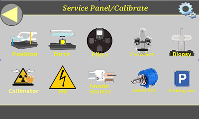

<!-- ------------------------Document header ------------------------------------>
 
 ___

   
   

<!-- ------------------------Document TITLE PAGE --------------------------------->
 

Z175 MAIN CPU

Technical Release Description

REV : 1.0

   
   
   
   

|Date |Revision | Change log| Author|
|:---| :----: | :----: |:---|
|25/01/2023|1.0|First release| M. Rispoli|

# 1. TABLE OF CONTENT

- [1. TABLE OF CONTENT](#1-table-of-content)
- [2. SCOPE](#2-scope)
- [3. Release Note](#3-release-note)
  - [3.1. Software Release Table](#31-software-release-table)
  - [3.2. Change Log](#32-change-log)
- [4. Software Requirement Specification](#4-software-requirement-specification)
- [5. Sotware Design Specification](#5-sotware-design-specification)
  - [5.1. Filter Activation option](#51-filter-activation-option)
    - [5.1.1. General requirements](#511-general-requirements)
    - [5.1.2. Service Panel activation](#512-service-panel-activation)
    - [5.1.3. IRS command activation](#513-irs-command-activation)
- [6. Test Plan](#6-test-plan)
  - [6.1. Filter Activation option](#61-filter-activation-option)
    - [6.1.1. General requirements](#611-general-requirements)
      - [6.1.1.1. Test](#6111-test)
      - [6.1.1.2. Test](#6112-test)
      - [6.1.1.3. Test](#6113-test)
      - [6.1.1.4. Test](#6114-test)
      - [6.1.1.5. Test](#6115-test)
    - [6.1.2. Service Panel activation](#612-service-panel-activation)
      - [6.1.2.1. Test](#6121-test)
      - [6.1.2.2. Test](#6122-test)
    - [6.1.3. IRS command activation](#613-irs-command-activation)
      - [6.1.3.1. Test](#6131-test)
- [7. Manual documentation](#7-manual-documentation)
  - [7.1. System Configuration](#71-system-configuration)
  - [7.2. Filter Calibration service panel](#72-filter-calibration-service-panel)

# 2. SCOPE 

This document provides technical notes necessary to modify the 
release's documentation if necessary:

+ Release Note;
+ Software Requirement Specification;
+ Software Design Specification;
+ User Manuals;
+ Technical Manuals;
+ Test Plan;

# 3. Release Note 

## 3.1. Software Release Table

||Previous Code|Current Rev Code|Changed Flag|
|:---|:---:|:---:|:---:|
|MainCPUDMD|1.7|1.9|X|
|FW240DMD|1.2|1.2||
|FW269|1.2|1.2||
|FW249U1|3.1|3.1||
|FW249U2|2.2|2.2||
|FW249U1A|2.5|2.5||
|FW249U2A|1.4|1.4||
|FW190|3.4|3.4||
|FW244|1.3|1.3||
||||

|MainCPUDMD|Previous Rev Code|Current Rev Code|Changed Flag|
|:---|:---:|:---:|:---:|
|DBTController|1.7|1.9|X|
|m4_master.bin|1.6|1.8|X|
|m4_slave.bin|1.4|1.4||
|mcc_ko|2.2|2.2||
||||

## 3.2. Change Log

+ New Feature: the Auto/Fixed Filter option selection is now available:
  + For Mammography Digital units of the Z175 family only the Automatic Filter selection was available: the Fixed filter option was not available. Due to diferent requirements of the MTL Kits, sharing the same Software Package, althogh at the moment the MET production still keep the Automatic Filter as a must, the Fixed filter option has been introduced to keep the Kits and Production units sharing the same software.

+ Feature Modified: the term *ACCESSORY* has been replaced with the therm *COMPONENT*  in all the GUI and message strings for all the Translated languages:
  + ENGLISH;
  + ITALIAN;
  + RUSSIAN;
  + FRANCE;
  + PORTUGUESE;
  + SPANISH;
    

# 4. Software Requirement Specification 

No modification is requested in the SRS document for this release.

# 5. Sotware Design Specification

## 5.1. Filter Activation option

### 5.1.1. General requirements

+ The Gantry shall allow to configure the Filter device as follows:
  + Fixed Filter;
  + Automatic Filter;

+ The Fixed Filter option should be valid only for 2D exposure and 2D AEC exposure;

+ In case the modality should be ***Fixed Filter***:
  + every command related to the Filter activation coming from the acquisition software shall be ignored;
  + every internal command that should change the filter shall be ignored/disabled;
  + every diagnostic test related to the filter activation shall be ignored/disabled;
  + in the Touch Screen service panel ***Calib Menu***  the ***Filter*** button shall not be showed;

+ In case the modality should be ***Automatic Filter*** then all the commands and diagnostic procedures related to the Filter control shall be operating.

+ The Filter activation option shall be stored into the /resource/config/sysCfg.cnf configuration 
file of the Master Terminal.

+ The option should be changed in two different modes:
  + through the service panel of the Master terminal;
  + through IRS interface command;

### 5.1.2. Service Panel activation

Like other options of the stCfg.cnf configuration file, 
this method applies ONLY at the first system installation.

+ At the first Power On after first installation, the Gantry shall 
display a graphical panel guiding the user to set the proper option
based on the hardware configuration of the Gantry.

+ The panel in this particolar case shall provide a binary option:
  + FIXED Filter option;
  + AUTO Filter option;

### 5.1.3. IRS command activation

To help further modification by Service operator,
a setting command shall be introduced in the IRS interface
to directly activate/deactivate this option.

# 6. Test Plan

## 6.1. Filter Activation option

### 6.1.1. General requirements

#### 6.1.1.1. Test

Pre condition:
+ System configured with the FIXED filter;

Test procedure:
+ From the AWS software select an arbitrary filter (Ag, Al, Rh, Cu);
  + Verify that the Gantry will not signal any error message;
  
#### 6.1.1.2. Test

Pre condition:
+ System configured with the FIXED filter;
+ AWS software in operating mode (no toolkit);

Test procedure:
+ From the AWS software activate a 2D Manual exposure with an arbitrary filter (Ag, Al, Rh, Cu);
  + Verify that the Gantry will not signal any error message;
+ From the AWS software activate a 2D AEC exposure with an arbitrary filter (Ag, Al, Rh, Cu);
  + Verify that the Gantry will not signal any error message;

#### 6.1.1.3. Test

Pre condition:
+ System configured with the FIXED filter;

Test procedure:
+ Open the Touch Screen Service Panel in the Calib menu;
  + Verify that the symbol of the Filter calibration is not displayed;

#### 6.1.1.4. Test

Pre condition:
+ System configured with the AUTOMATIC filter;
+ AWS software in operating mode (no toolkit);

Test procedure:

+ From the AWS software activate a 2D Manual exposure with an arbitrary filter (Ag, Al, Rh, Cu);
  + Verify that the Gantry will not signal any error message;
  + Verify that the Filter device actually select the desidered filter;
  
+ From the AWS software activate a 2D AEC exposure with an arbitrary filter (Ag, Al, Rh, Cu);
  + Verify that the Gantry will not signal any error message;
  + Verify that the Filter device actually select the desidered filter;

+ From the AWS software activate a 3D Manual exposure with an arbitrary filter (Ag, Al, Rh, Cu);
  + Verify that the Gantry will not signal any error message;
  + Verify that the Filter device actually select the desidered filter;
  + Verify that the filter position follows the Tube motion during the scan;

+ From the AWS software activate a 3D AEC exposure with an arbitrary filter (Ag, Al, Rh, Cu);
  + Verify that the Gantry will not signal any error message;
  + Verify that the Filter device actually select the desidered filter;
  + Verify that the filter position follows the Tube motion during the scan;

+ From the AWS software activate the AE exposure with an arbitrary filter (Ag, Al, Rh, Cu);
  + Verify that the Gantry will not signal any error message;
  + Verify that the Filter device actually select the desidered filter in the low energy pulse;
  + Verify that the Filter device actually select the Cu filter in the high energy pulse;
  
#### 6.1.1.5. Test

Pre condition:
+ System configured with the AUTOMATIC filter;

Test procedure:
+ Open the Touch Screen Service Panel in the Calib menu;
  + Verify that the symbol of the Filter calibration is displayed;
  
+ Enter the Filter calibration menu and activate one of the arbitrary filters:
  + Verify that the filter device executes the given filter selection;

  
### 6.1.2. Service Panel activation

#### 6.1.2.1. Test

Pre condition:
+ remove the /resouce/config/sysCfg.cnf file from the Master TS terminal;

Test procedure:

+ reboot the system;
  + Verify that the Gantry stops the startup sequence opening the Configuration Panel; 
  + Verify that the panel allow to select the Filter mode only with a binary selection: AUTO or FIXED;

+ Select the FIXED mode then store the selection;
  + Verify that after the system startup, the file /resource/config/sysCfg.cnf is configured with the Filter option to FIXED;

#### 6.1.2.2. Test

Pre condition:
+ remove the /resouce/config/sysCfg.cnf file from the Master TS terminal;

Test procedure:

+ reboot the system;
  + Verify that the Gantry stops the startup sequence opening the Configuration Panel; 
  
+ Select the Filter AUTOMATIC mode then store the selection;
  + Verify that after the system startup, the file /resource/config/sysCfg.cnf is configured with the Filter option to AUTOMATIC;

### 6.1.3. IRS command activation

#### 6.1.3.1. Test

Test procedure:

+ Open the IRS panel and enter the ***config:*** menu;
  + Verifiy that in the menu is present the ***setAutoFilter*** command;
  
+ Execute the ***setAutoFilter ON** command;
  + Verify that the file /resource/config/sysCfg.cnf is configured with the Filter option set to AUTOMATIC;

+ Execute the ***setAutoFilter OFF** command;
  + Verify that the file /resource/config/sysCfg.cnf is configured with the Filter option set to FIXED;
  
  

  
# 7. Manual documentation

## 7.1. System Configuration

In the chapter related to the System options, update the 
panel with the following image:

 

 In the description of the panel add the description of the Filter selection:

 + Selection of the AUTOMATIC Filter option:

 

+ Selection of the FIXED Filter option:

 
 

## 7.2. Filter Calibration service panel

In the section related to the Filter calibration tool,
where it is showed the Filter icon button, modify the description 
with the following indication:

+ When the Filter option is AUTOMATIC:

 

+ When the Filter option is FIXED:

 
